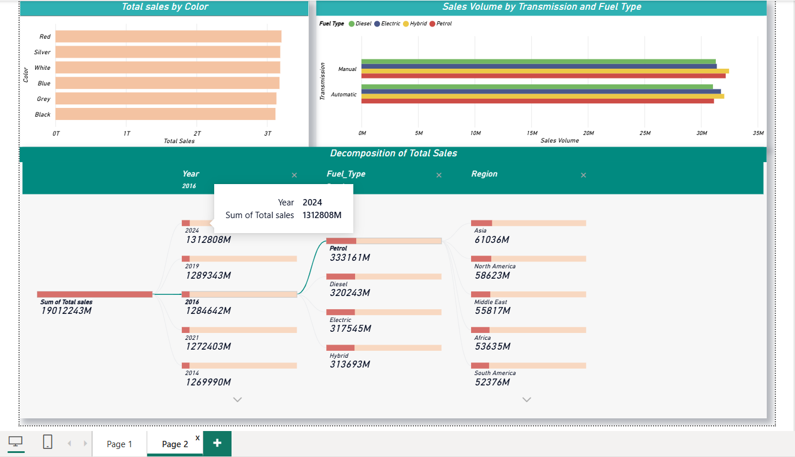

# BMW-Sales-Analysis-PowerBI
BMW sales data analysis (2010–2024) using Power BI with interactive dashboard and insights

## PROJECT OVERVIEW

This project analyzes BMW sales data from 2010 to 2024 using Power BI. It focuses on understanding sales trends, customer preferences, and regional performance. Interactive dashboards were created to visualize key metrics and insights.

## TOOLS USED

 * Power BI
 * Data Cleaning & Transformation

## DATASET

Source:https://www.kaggle.com/datasets/ahmadrazakashif/bmw-worldwide-sales-records-20102024

## STEPS FOLLOWED

### 1. Data Cleaning

 * Cleaned dataset and handled inconsistencies

 * Formatted numerical and currency values

### 2. Data Transformation

 * Created new columns like Engine Category and Mileage Category

 * Prepared dataset for visualization

### 3. Data Visualization

 * Built charts such as donut, bar, area, and map

 * Added slicers for Year, Color, and Transmission

### 4. Dashboard Creation

 * Designed interactive Power BI dashboard

 * Added KPIs and visual elements

## DASHBOARD FEATURES

### 1. Key Performance Indicators (KPIs)

 * Total Sales: 19,012 Bn

 * Total Sales Volume: 253 M

 * Average Unit Price: 75.03 K

 * Average Mileage: 100.31 K
   
### 2. Model Highlights

 * Used images to represent BMW models (3 Series, 5 Series, 7 Series)

 * Improves visual appeal and user experience

### 3. Regional Sales Performance Map

 * Filled map showing global sales distribution

 * Highlights high-performing regions like Europe and Asia

### 4. Sales Volume Trend by Year

 * Area chart showing trends from 2010 to 2024

 * Sales peak observed around 2022

### 5. Top 5 Car Models

 * Clustered column chart ranking best-selling models

 * Identifies top performers like 7 Series and X5

### 6. Sales Volume by Fuel Type

 * Donut chart showing distribution of fuel types

 * Helps understand customer preferences

### 7. Slicers (Filters)

 * Filters for Year, Color, and Transmission

 * Enables interactive dashboard exploration

## KEY INSIGHTS

 * Petrol vehicles dominate overall sales

 * Automatic transmission is more popular

 * Sales vary significantly across regions

 * Customer preferences differ by fuel type and color

 * Sales volume peaked around 2022

## DASHBOARD PREVIEW

### Overview Dashboard

### Analysis Dashboard

## FILES INCLUDED

bmw_dashboard.pbix

bmw_sales_dataset.xlsx

bmw_sales_cleaned_dataset.xlsx

dashboard_overview

overview_dashboard

